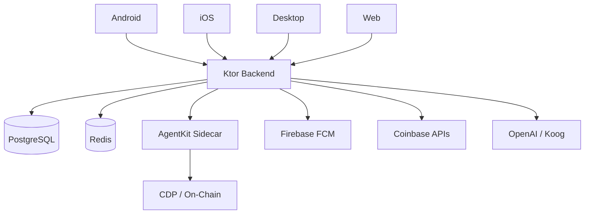
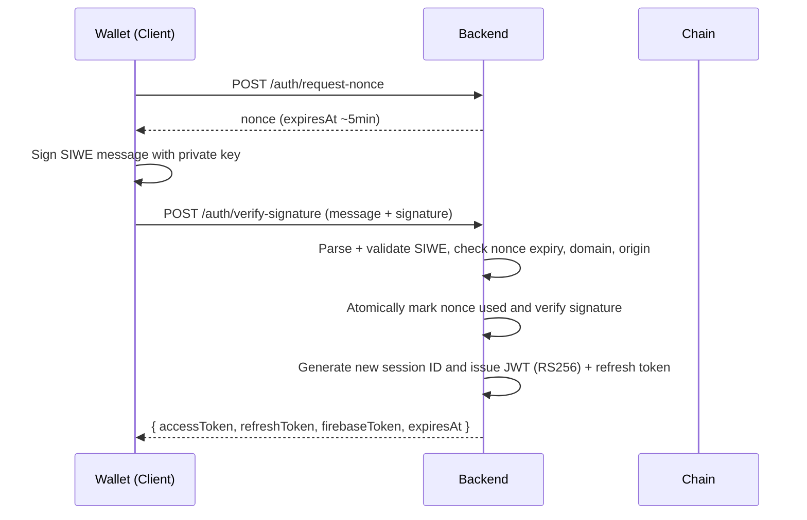

# Leta Pay

**Tagline:** A Kotlin Multiplatform DeFi wallet with integrated AI agents and sidecar execution.

Hardening pass: runtime TODOs and platform shim placeholders cleaned (verified 2026-05-27).
Backend startup note: long-running reconciliation and watcher jobs are production-only so test boots can shut down cleanly.

- Kotlin | KMP | Ktor | Compose Multiplatform | License: MPL-2.0 | Build: Gradle
- Platform support: Android | iOS | Desktop | Web

Badges (shields.io)
- 
- 
- 
- 
- 
- 

### Hook
Leta Pay is a Kotlin Multiplatform (KMP) wallet and DeFi client that exposes programmatic swap, transfer, and staking workflows for on‑chain execution, and couples those flows with an AI agent layer for intent parsing and orchestration. The app shares business logic across Android, iOS, Desktop, and Web while the backend (Ktor) handles auth, quote orchestration, notifications, and AgentKit sidecar coordination.

---

## Table of contents

- **Overview**
	- What is Leta Pay
	- Platform support
- **Architecture**
	- System diagram
	- Module graph
	- Why this architecture?
- **Security**
	- SIWE flow (sequence)
	- JWT (RS256) and key provider
	- Rate limiting
	- Sidecar isolation
	- Transport & logging hardening
- **DeFi capabilities**
- **AI agent layer**
- **Backend plugin stack**
- **Observability**
- **Local development**
- **Testing**
- **Code quality gates**
- **Deployment**
- **Environment variables**
- **Contributing**
- **Roadmap**
- **FAQ**
- **Recommended assets to add later**

---

## What is Leta Pay

Leta Pay is a multiplatform DeFi wallet built with Kotlin Multiplatform and Compose Multiplatform. It enables users to obtain swap quotes, build unsigned transactions (calldata), submit transfers and staking instructions, and watch confirmations — all from a single shared codebase that runs on Android, iOS, Desktop (JVM) and Web.

The mobile and desktop clients implement the UI and local intent parsing (the client-side AI), while the backend — a Ktor server — provides authenticated APIs, token issuance, quote orchestration, and integration with an AgentKit sidecar for deterministic on‑chain builds and calls. AgentKit is accessed via a locally-run Node.js sidecar (the AgentKit sidecar) which performs CDP AgentKit actions on behalf of the backend.

An AI layer combines on-device parsing (for low-latency intent extraction) with server-side Koog/OpenAI orchestration for multi-step plans and conversational interfaces. All state-changing operations use idempotency keys and transaction-watching + push notifications to ensure reliable UX for on-chain flows.

(Read the architecture summary in [docs/ARCHITECTURE.md](docs/ARCHITECTURE.md) for the canonical module graph.)

---

## Platform support

| Platform | Status | Notes |
|----------|--------|-------|
| Android  | ✅     | Jetpack Compose (Compose Multiplatform) UI; FCM push tokens supported. |
| iOS      | ✅     | SwiftUI shell with KMP shared logic via CocoaPods in `cmp-ios`. |
| Desktop  | ✅     | Compose for Desktop (JVM). |
| Web      | ✅     | Kotlin/JS + Compose for Web via `cmp-web`. |
| Backend  | ✅     | Ktor server (JVM), runs in Docker. See `backend-ktor`. |
| Sidecar  | ✅     | Node.js AgentKit sidecar under `agentkit-sidecar` (Express). |

(Platform responsibilities are documented at [docs/MODULES.md](docs/MODULES.md).)

---

## Architecture overview



Module relationships (high level):
- `cmp-android` / `cmp-ios` / `cmp-desktop` / `cmp-web` → `cmp-shared` → `cmp-navigation` → `feature:*` modules.
- Feature modules depend on `core:domain` and `core:model`. `core:data` provides repository implementations which use `core:network` and `core:database`.
- Server-side modules live in `backend-ktor`; sidecar logic is in `agentkit-sidecar`.

Why this architecture?
> KMP is used to maximize code reuse for business logic, models and UI primitives across mobile, desktop, and web, minimizing platform-specific duplication. Ktor was chosen for a compact, coroutine-friendly server that aligns well with Kotlin tooling and the project's lightweight service surface. SQLDelight is preferred in shared modules for predictable, typed queries across platforms; platform-specific persistence (e.g., Android Room alternatives) is encapsulated behind `core-base:*` expect/actual modules. This approach emphasizes single-source business logic, small platform shims, and an explicit sidecar for operations that require an SDK (AgentKit) available in Node.

(See [docs/ARCHITECTURE.md](docs/ARCHITECTURE.md) for the module graph and data flow.)

---

## KMP module reference

<details>
<summary>Module list (expand)</summary>

| Module | Layer | Responsibility | Key dependencies |
|--------|-------|----------------|------------------|
| cmp-android | App | Android app entry point | `cmp-shared`, Compose, AndroidX |
| cmp-ios | App | iOS app shell | `cmp-shared` via CocoaPods |
| cmp-desktop | App | Desktop JVM app | Compose for Desktop |
| cmp-web | App | Web client | Kotlin/JS, Compose |
| cmp-shared | Shared UI | Shared Compose screens, navigation | `feature:*`, `core:*` |
| cmp-navigation | Shared | Navigation abstraction | `cmp-shared` |
| feature:auth | Feature | Wallet/SIWE flows | `core:domain`, `core:network` |
| feature:wallet | Feature | Wallet management | `core:model`, `core:data` |
| feature:trade | Feature | Swap UI & flows | `core:data`, `core:ai` |
| feature:chat | Feature | Conversational AI frontend | `core:ai`, Koog client |
| core:model | Core | Data models & DTOs | Serialization |
| core:domain | Core | UseCases & interfaces | Repositories |
| core:data | Core | Repository implementations | Ktor client, SQLDelight |
| core:network | Core | Ktor client config & services | kotlinx.serialization |
| core:database | Core | SQLDelight schemas | SQLDelight |
| core:ai | Core | Client-side parsing & intent extraction | kotlinx.serialization |
| agentkit-sidecar | Infra | Node.js sidecar for AgentKit/CDP | @coinbase/agentkit SDK |

</details>

(Expanded module responsibilities are in [docs/MODULES.md](docs/MODULES.md).)

---

## Authentication & Security model

This section documents the exact, code-backed security behavior implemented in the backend.

### SIWE (Sign-In With Ethereum)
- Endpoints:
	- Request nonce: `POST /auth/request-nonce` — implemented by `backend-ktor/src/.../AuthRoutes.kt`.
	- Verify signature: `POST /auth/verify-signature` — `AuthRoutes.kt` routes into `AuthService.verify`.
- Nonce issuance and expiry:
	- Nonces are generated server-side and persisted. The generated nonce expiry is five minutes (5 × 60 × 1000 ms) — see `DefaultAuthService.generateNonce()` and the constant `FIVE_MINUTES_MS`.
- How it works:
	- Client requests a nonce (`/auth/request-nonce`), signs a SIWE message locally, then posts message+signature to `/auth/verify-signature`.
	- The server parses the SIWE message using `SiweMessageValidator`, validates domain + origin, checks the persisted nonce and expiry, and performs signature recovery/verification (see `DefaultAuthService.verify` and `verifySignature(...)`).
- Nonce enforcement & replay protection:
	- Nonces are persisted and atomically marked used inside the transaction before issuing tokens; if a nonce has been used the attempt fails with `NonceAlreadyUsedError` (see `Nonces.update(...)` in `DefaultAuthService.verify`).
- Domain + origin binding:
	- SIWE validation compares the message to configured `AppConfig.appDomain` and `AppConfig.appOrigin` via `SiweConfig` (see `DefaultAuthService.verify` and `AppConfig`).
- Session fixation:
	- On successful verification, a new session ID is created and written to `Sessions` before tokens are returned (see `issueTokens` in `DefaultAuthService`).

Mermaid sequence diagram for SIWE:



### JWT (RS256)
- Algorithm & key provider:
	- The server signs session tokens with RS256 using the `JwtTokenService` (see `JwtTokenService.kt`) and an injected `JwtKeyProvider`.
	- The DI module chooses `DevJwtKeyProvider` if running in dev without explicit keys, otherwise `RsaJwtKeyProvider` with keys from `AppConfig` (see `DependencyInjection.kt`).
- JWKS endpoint:
	- Public key distribution is available at `GET /.well-known/jwks.json` (see `configureAuthRoutes()` in `AuthRoutes.kt`).
- Token expiry:
	- Session expiry is produced when minting tokens (`issueTokens` in `DefaultAuthService`) and driven by an `expiresAt` Instant used for JWT expiry. Refresh expiry uses a seven‑day window (`SEVEN_DAYS_MS`).

### Rate limiting
- RateLimiter abstraction:
	- `RateLimiter` is registered as a DI interface.
	- Currently the implementation falls back to `InMemoryRateLimiter` in DI for dev/initial deployments (see `DependencyInjection.kt` comments and `single<RateLimiter> { InMemoryRateLimiter() }`).
- Application:
	- Rate limiting is applied on pre-auth flows in `AuthRoutes` (via `call.enforcePreAuthRateLimit(...)`) and other sensitive endpoints (middleware wrappers).
- Scalability note:
	- The backend uses Redis-backed rate limiting and Redis-backed shared caches for horizontal scaling.

### AgentKit sidecar isolation
- Sidecar transport and mutual auth:
	- The Node.js sidecar enforces an internal-only middleware (`agentkit-sidecar/src/middleware/internalOnly.ts`) that requires either `X-Internal-Token` or `X-Sidecar-Secret` and compares the header value to the configured secret using `crypto.timingSafeEqual` to prevent timing attacks.
	- The backend injects `sidecarSecret` from `AppConfig` and constructs `SidecarAgentKitClient` in DI when configured (see `DependencyInjection.kt`).
- Network exposure:
	- The sidecar is intended for internal network usage (default `http://agentkit-sidecar:3100`) and the server-side DI checks whether an explicit sidecar URL is provided.
- Transaction guardrails:
	- The backend and sidecar enforce `MAX_TRANSACTION_VALUE_ETH` before building swap, transfer, and stake calldata.
- Error masking:
	- Sidecar and backend error handlers intentionally return sanitized errors to clients (see `agentkit-sidecar/src/middleware/errorHandler.ts` and `StatusPages.kt`), and logs keep full stack traces internal only.

### Transport & logging
- HTTPS required in production (configuration enforces modern transports in deploy configuration).
- Request ID sanitation and CRLF protections are implemented: Monitoring plugin generates safe `X-Request-ID` values (`Monitoring.kt`), and `RequestHardeningPlugin` prevents CRLF and control characters in request IDs.
- Structured logging:
	- `RequestHardeningPlugin` uses MDC to attach `requestId`, `walletAddress` (truncated), `sessionId`, and `txHash` to logs; `StatusPages` maps domain errors to consistent HTTP envelopes without exposing internal stack traces.

---

## DeFi capabilities

The server and sidecar implement the exact on‑chain primitives documented below (these are implemented in the backend routes and AgentKit sidecar):

- Token swaps:
	- Quote endpoint: `POST /swap/quote` returns swap quote data and estimated fees (see `backend-ktor` routes + `agentkit-sidecar/src/routes/swap.ts` for quote invocation).
	- Build endpoint: sidecar builds calldata objects for deterministic construction (`agentkit-sidecar/src/routes/swap.ts` and `build` route).
- ETH / ERC-20 transfers:
	- The sidecar supports deterministic builds for token transfers (`agentkit-sidecar/src/routes/transfer.ts`) and crate calldata with token addresses per network.
- Staking / yield positions:
	- Sidecar provides deterministic calldata for staking flows (`agentkit-sidecar/src/routes/stake.ts`).
- Transaction confirmation & watchers:
	- Backend includes a `ConfirmationWatcher` service wired in DI (see `DependencyInjection.kt`) and push notifications integration via Firebase tokens (DI chooses a Firebase client if SA credentials are present).
- Idempotency:
	- All state-changing operations require and honor `Idempotency-Key` headers for `swap/execute` and `yield/stake` flows — the API enforces idempotency and the backend stores tokens/commands in the database (see `API.md` and idempotency services wired in DI).

---

## AI agent layer

- Client-side AI:
	- The `core:ai` module provides on-device parsing and intent extraction to keep latency low and reduce server roundtrips (see `docs/MODULES.md`).
- Server-side orchestration:
	- Koog integration is present (Koog config is inspected in `plugins/Koog.kt`) and DI registers an `AiCommandService` implementation (see `DependencyInjection.kt`).
	- The Ktor backend exposes SSE streaming for chat (`GET /ai/chat-stream`), `POST /ai/parse`, and `POST /ai/plan` endpoints (see `docs/API.md` and `backend-ktor` routes).
- AgentKit sidecar:
	- The Node.js sidecar uses the official `@coinbase/agentkit` SDK and builds AgentKit instances per user address (see `agentkit-sidecar/src/agentkit.ts`), including wallet provider config via CDP credentials.
- Circuit breaking:
	- DI config supplies named circuit breakers for `coinbase`, `openai` (Koog), and `firebase` calls to prevent cascading failures (`DependencyInjection.kt`).

---

## Backend plugin stack

The backend configures a compact set of Ktor plugins; the main plugins and responsibilities (backed by code) are:

| Plugin | Purpose |
|--------|---------|
| `Authentication` (JWT) | Verifies RS256 session tokens and maps valid tokens to `WalletPrincipal` (`Security.kt`). |
| `StatusPages` | Maps `BackendException` and validation errors to consistent `ErrorResponse` envelopes (`StatusPages.kt`). |
| `RequestValidation` | DTO validators for SIWE, swap, stake, transfer, and other inputs (`Serialization.kt`). |
| `RateLimit` (service) | Pre-auth rate limiting hooks invoked in routes (DI registers `RateLimiterService`). |
| `CORS` | Production-safe allowlist for `letapay.app` and `localhost:3000` (`Routing.kt`). |
| `MicrometerMetrics` | Prometheus metrics via PrometheusMeterRegistry and a `/metrics` endpoint (`Monitoring.kt`). |
| `DoubleReceive` | Safe double-read of request bodies for middleware + handlers (`Serialization.kt`). |
| `ContentNegotiation` | `kotlinx.serialization` JSON used uniformly (`Serialization.kt`). |
| `SSE` | Server-sent events for streaming AI chat (`Routing.kt`). |

(See `backend-ktor/src/main/kotlin/com/letapay/backend/plugins/` for plugin implementations: `Security.kt`, `Monitoring.kt`, `StatusPages.kt`, `Serialization.kt`, `Routing.kt`, `Koog.kt`, `DependencyInjection.kt`.)

---

## Observability

- Structured logging with MDC: requestId, truncated walletAddress, sessionId, txHash — implemented in `RequestHardeningPlugin` (`Monitoring.kt`).
- Request ID sanitization to prevent CRLF and control characters.
- Prometheus metrics are exposed at `GET /metrics` and collected via `MicrometerMetrics` (`Monitoring.kt`).
- Health endpoint: sidecar and backend expose `/health` and health routes are configured in `Routing.kt`.
- DB pooling metrics: HikariCP metrics are available when Hikari is configured (dependencies in `gradle/libs.versions.toml`).
- Tracing and observability tooling is expected to be composed via the Docker Compose observability stack (Prometheus + Grafana + Jaeger), referenced in project deployment docs.

---

## Local development setup

Prerequisites (recommended):
| Tool | Version | Purpose |
|------|---------|---------|
| JDK | 17+ | Build and run KMP/Ktor |
| Node | 18+ | AgentKit sidecar |
| Docker | 24+ | Local infra (Postgres, Redis, etc.) |
| Android Studio | Hedgehog+ | Android dev & emulators |
| yarn / npm | latest | sidecar dependencies |

Steps (minimum):

1. Clone:
```bash
git clone https://github.com/Wolfof420Street/Leta-Pay-KMP.git
cd Leta-Pay-KMP
```

2. Copy env for local dev:
```bash
cp secrets.env.template .env.dev
# or create .env.dev and set variables described below
```

3. Required environment variables (dev notes):
- `JWT_PRIVATE_KEY` — (optional in dev) RSA PEM private key for RS256; if missing in dev, `DevJwtKeyProvider` will be used.
- `JWT_PUBLIC_KEY` — (optional in dev) RSA PEM public key.
- `SESSION_SECRET` — min 32 bytes.
- `REFRESH_TOKEN_PEPPER` — refresh token pepper (used with Argon2 hashing).
- `DATABASE_URL` — Postgres connection string (or use Docker compose).
- `REDIS_URL` — Redis connection string for rate limiting and shared caches.
- `DB_MIN_POOL_SIZE`, `DB_MAX_POOL_SIZE`, `DB_CONNECTION_TIMEOUT_MS` — optional HikariCP tuning.
- `SIDECAR_INTERNAL_TOKEN` or `SIDECAR_SECRET` — mutual auth secret for AgentKit sidecar.
- `APP_DOMAIN` — SIWE domain (default `letapay.app` in `AppConfig`).
- `APP_ORIGIN` — SIWE origin (default `https://letapay.app`).
- `MAX_TRANSACTION_VALUE_ETH` — maximum allowed value for swap, transfer, and stake builds.
- CDP credentials for AgentKit sidecar (if testing sidecar actions): `CDP_API_KEY_ID`, `CDP_API_KEY_SECRET`, `CDP_WALLET_SECRET`.
- Firebase service account / path: `FIREBASE_SA_JSON` or `FIREBASE_SA_PATH` (optional for push in dev).
- The backend env loader also accepts `ENVIRONMENT` as an alias for `ENV`.

(For full variable list, see the Environment Variables Reference below and `backend-ktor/src/main/kotlin/com/letapay/backend/config/AppConfig.kt`.)

4. Generate dev JWT keys (optional):
```bash
openssl genpkey -algorithm RSA -pkeyopt rsa_keygen_bits:2048 -out private.pem
openssl rsa -in private.pem -pubout -out public.pem
export JWT_PRIVATE_KEY="$(cat private.pem)"
export JWT_PUBLIC_KEY="$(cat public.pem)"
```

5. Start local infra:
```bash
docker compose -f docker-compose.local.yml up -d
```

6. Start sidecar:
```bash
cd agentkit-sidecar
npm install
npm run dev
# Ensure SIDECAR_INTERNAL_TOKEN or SIDECAR_SECRET is set in .env.dev or env for sidecar
```

7. Start backend:
```bash
# from repo root
./gradlew :backend-ktor:run
```

8. Run clients:
- Android: `./gradlew :cmp-android:installDebug`
- Desktop: `./gradlew :cmp-desktop:run`
- Web: `./gradlew :cmp-web:jsBrowserDevelopmentRun`

---

## Testing

- Backend unit & integration tests:
	```bash
	./gradlew :backend-ktor:test
	```
	Tests cover routing, SIWE flows, token rotation, and repository logic. The test setup uses a `DevJwtKeyProvider` and database test fixtures where appropriate.
- DevJwtKeyProvider:
	- Tests and the dev server use an ephemeral keypair when `JWT_PRIVATE_KEY`/`JWT_PUBLIC_KEY` are not provided (`DependencyInjection.kt`).
- Full verification:
	```bash
	./gradlew check
	```
- Run a single test class:
	```bash
	./gradlew :backend-ktor:test --tests "com.letapay.backend.service.AuthServiceTest"
	```

---

## Code quality gates

| Gate | Command | What it checks |
|------|---------|----------------|
| Detekt | `./gradlew detekt` | Static analysis including multiplatform rules |
| Spotless | `./gradlew spotlessCheck` | Formatting / ktlint |
| Tests | `./gradlew :backend-ktor:test` | Backend correctness |
| TypeScript | `cd agentkit-sidecar && npx tsc --noEmit` | Sidecar type correctness |

CI is expected to run these gates on every PR (see `.github` workflows referenced from CLAUDE.md).

---

## Deployment

- Production compose: use `docker-compose.prod.yml` for container composition and secrets injection.
- Production env-vars: same as dev list plus 3rd-party keys (Coinbase/CDP credentials, Firebase SA, Coinbase API keys, OpenAI/Koog API keys).
- GitHub Actions:
	- Reusable workflows and branch-based gating are used (see CLAUDE.md and `.github` for workflows). The CI design uses concurrency controls and separate staging/prod gates.
- Container security:
	- Images should run `runAsNonRoot`, use `readOnlyRootFilesystem`, and drop unnecessary Linux capabilities. The project documentation recommends these post-build container hardening steps (see `deployment.md`).

---

## Environment variables reference

| Variable | Required | Description |
|----------|----------|-------------|
| `ENV` | Required in prod | Backend runtime environment selector (`dev`, `staging`, `production`). |
| `ENVIRONMENT` | Optional | Alias for `ENV` read by backend env loader. |
| `PORT` | Optional | Backend/sidecar process port override (defaults to 8080 backend, 3100 sidecar). |
| `DATABASE_URL` | Required in prod | Postgres JDBC URL for `backend-ktor`. |
| `DB_MIN_POOL_SIZE` | Optional | HikariCP minimum idle connections. |
| `DB_MAX_POOL_SIZE` | Optional | HikariCP maximum pool size. |
| `DB_CONNECTION_TIMEOUT_MS` | Optional | HikariCP connection timeout in milliseconds. |
| `REDIS_URL` | Required in prod | Redis connection string used by backend rate limiting/shared cache. |
| `SESSION_SECRET` | Required in prod | Session/JWT secret (non-placeholder required for production startup). |
| `REFRESH_TOKEN_PEPPER` | Required in prod | Pepper used for refresh-token hashing. |
| `JWT_PRIVATE_KEY` | Optional (dev) / Required (prod RS256 mode) | RSA PEM private key for asymmetric JWT signing. |
| `JWT_PUBLIC_KEY` | Optional (dev) / Required (prod RS256 mode) | RSA PEM public key for asymmetric JWT verification/JWKS. |
| `JWT_ISSUER` | Optional | JWT issuer override. |
| `JWT_AUDIENCE` | Optional | JWT audience override. |
| `APP_DOMAIN` | Required in prod | SIWE domain used by backend message validation. |
| `APP_ORIGIN` | Required in prod | SIWE origin used by backend message validation. |
| `AI_PARSE_MODEL` | Optional | Parse model override for AI parse endpoint. |
| `AI_PLAN_MODEL` | Optional | Plan model override for AI planning. |
| `AI_CHAT_MODEL` | Optional | Chat model override for AI chat streaming. |
| `OPENAI_API_KEY` | Required when AI features enabled | API key used by Koog/OpenAI integration. |
| `AGENTKIT_SIDECAR_URL` | Optional | Backend-to-sidecar URL override. |
| `SIDECAR_SECRET` | Required in prod | Backend shared secret for sidecar internal-auth calls. |
| `SIDECAR_INTERNAL_TOKEN` | Required in prod sidecar deployments | Alternate accepted sidecar internal-auth token. |
| `MAX_TRANSACTION_VALUE_ETH` | Required in prod | Max allowed value for swap/transfer/stake build requests. |
| `CDP_API_KEY_ID` | Required for sidecar AgentKit runtime | Coinbase CDP API key ID for wallet provider configuration. |
| `CDP_API_KEY_SECRET` | Required for sidecar AgentKit runtime | Coinbase CDP API key secret for wallet provider configuration. |
| `CDP_WALLET_SECRET` | Required for sidecar AgentKit runtime | Coinbase wallet secret used by AgentKit wallet provider. |
| `COINBASE_API_KEY` | Optional | Backend Coinbase CDP service API key. |
| `COINBASE_RISK_KEY` | Optional | Backend screening/risk service key. |
| `FIREBASE_SA_JSON` | Optional | Inline Firebase service account JSON for push/token services. |
| `FIREBASE_SA_PATH` | Optional | Filesystem path to Firebase service account JSON. |
| `BASE_STAKING_ENABLED` | Optional | Runtime toggle for base staking operations. |
| `KILL_SWITCH_VALUE_MOVES` | Optional | Runtime kill switch for value-moving endpoints. |
| `ETHEREUM_RPC_URL` | Optional | Sidecar Ethereum RPC override for gas estimation. |
| `POLYGON_RPC_URL` | Optional | Sidecar Polygon RPC override for gas estimation. |
| `BASE_RPC_URL` | Optional | Sidecar Base RPC override for gas estimation. |

(Authoritative parsing and defaults are implemented in `backend-ktor/src/main/kotlin/com/letapay/backend/config/AppConfig.kt` and `EnvLoader.kt`.)

---

## Contributing

- Branch naming: `feat/...`, `fix/...`, `chore/...`.
- PR requirements:
	- All PRs must pass: `detekt`, `spotlessCheck`, backend tests, and sidecar `npx tsc --noEmit`.
- Commit messages: follow Conventional Commits (type(scope): subject).
- Code rules enforced by review:
	- No `!!` operator in shared code.
	- Avoid `GlobalScope`.
	- Avoid `java.*` classes in `commonMain`.
	- No dependency version bumps without opening a discussion/issue.
- See contributor checklist in `CONTRIBUTING.md`.

---

## Project roadmap (inferred)

Near-term
- Harden `EnvLoader` and restrict dev defaults for production.

Medium-term
- Migrate JwtKeyProvider to expect/actual typed key support across platforms.
- Enforce container security features in production compose.

Future
- Full artifact-based CI/CD (binary artifacts per platform).
- Pin third-party actions with SHA and enable Dependabot policy per CLAUDE guidance.

(See `docs/AUDIT.md` for the security audit and a prioritized set of findings and fixes.)

---

## FAQ

Q: Why KMP and not Flutter?
A: KMP enables sharing Kotlin business logic, models and Compose UI primitives across multiple platforms while staying native on each platform. This project explicitly targets reusing domain code and Compose-based UI primitives (`cmp-shared`) rather than rewiring platform language boundaries.

Q: Why SIWE and not OAuth?
A: SIWE provides signature-based authentication using a user’s wallet, eliminating centralized credential storage and aligning with the UX expectations of web3 users. The backend preserves nonce/replay protections and session issuance.

Q: Why a Node.js sidecar for AgentKit?
A: AgentKit's official SDK in this repository targets Node/JS; the sidecar isolates that SDK and keeps the backend language-agnostic. The sidecar enforces mutual internal auth and returns deterministic calldata to the backend.

Q: Is this production-ready?
A: The repo implements production-grade primitives (RS256 JWT, SIWE, idempotency, circuit breakers). The audit highlights a small number of remaining operational hardenings (e.g., replacing in-memory rate limiting and caches with Redis for horizontal scaling) before an aggressive production rollout. See [docs/AUDIT.md](docs/AUDIT.md#L1-L120).

Q: Can I use this as a template for my own DeFi app?
A: Yes; the codebase is structured as an opinionated KMP DeFi template. Before production use, address the AUDIT recommendations (Redis migration, env hardening, CI artifacts, pinned action SHAs).

---

## Recommended assets to add later

- Screenshots:
	- Onboarding + SIWE flow (mobile: Android & iOS).
	- Swap quote → build → signed tx confirmation (Desktop and Web).
	- Agent chat flow showing plan generation + executed step.
- Diagrams to generate:
	- Module dependency graph rendered by moduleGraph (D2 or Excalidraw friendly).
	- Sequence diagrams for swap execute, refresh token rotation, and confirmation watcher.
- Demo GIFs:
	- Swap quote to built calldata (client → backend → sidecar).
	- AI agent planning a multi-step swap + confirm flow.
- Tooling recommendations:
	- Use D2 or Excalidraw for architecture diagrams; Mermaid for inline docs diagrams (already used).
	- Export high-resolution PNGs and WebP for README/website.

---

## References & code pointers

- Architecture: [docs/ARCHITECTURE.md](docs/ARCHITECTURE.md)
- Module responsibilities: [docs/MODULES.md](docs/MODULES.md)
- API endpoints: [docs/API.md](docs/API.md)
- Audit: [docs/AUDIT.md](docs/AUDIT.md)
- Backend plugins: [backend-ktor/src/main/kotlin/com/letapay/backend/plugins](backend-ktor/src/main/kotlin/com/letapay/backend/plugins)
- Sidecar: [agentkit-sidecar/src](agentkit-sidecar/src)
- Dependency & versions: [gradle/libs.versions.toml](gradle/libs.versions.toml)

---
