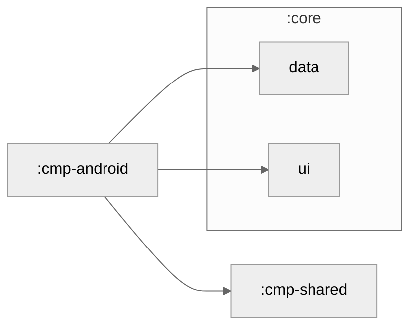

# cmp-android

The Android application for **LetaPay** - a non-custodial crypto wallet with AI agent orchestration.

## Overview

Built with:
- **Kotlin** (Kotlin Multiplatform integration)
- **Compose Multiplatform** for UI
- **Jetpack components** (Navigation, Security, Work, etc.)
- **Firebase** for auth, chat, and notifications
- **WalletConnect** for non-custodial wallet signing

## Architecture

```
cmp-android/
├── src/main/kotlin/org/letapay/app/android/
│   ├── MainActivity.kt         # App entry point
│   ├── LetaPayApp.kt           # Application class
│   └── [other Android-specific code]
├── src/main/res/
│   ├── values/                 # Strings, colors, dimens
│   ├── drawable/               # Images and icons
│   └── mipmap/                 # App icons
├── AndroidManifest.xml         # App manifest
├── google-services.json        # Firebase config
└── build.gradle.kts            # Android build config
```

## Module Graph



## Key Features

- **WalletConnect Integration** - Connect external wallets (MetaMask, Ledger, etc.)
- **Push Notifications** - Firebase Cloud Messaging
- **Biometric Authentication** - Fingerprint/Face ID support
- **Deep Linking** - Share wallet addresses and payment requests
- **Android 12+ Features** - Predictive back gesture, splash screen API

## Setup

### Prerequisites

- Android Studio 2024.2 or later
- Android SDK 34 (minimum API 24)
- Google Play Services SDK

### Build

```bash
# Debug build
./gradlew cmpAndroid:assembleDebug

# Release build (requires signing keys)
./gradlew cmpAndroid:assembleRelease

# Install on emulator/device
./gradlew cmpAndroid:installDebug
```

### Firebase Configuration

1. Download `google-services.json` from Firebase Console
2. Place in `cmp-android/`
3. Configure variants:
   - `prod` - Production app
   - `demo` - Demo/testing app

All variants are pre-configured in `google-services.json` with proper Firebase app IDs.

## Deployment

### Firebase App Distribution

```bash
./gradlew cmpAndroid:assembleRelease
bash scripts/deploy_firebase.sh
```

### Google Play Store

```bash
# Internal testing
./gradlew cmpAndroid:bundleRelease
bash scripts/deploy_playstore.sh internal

# Beta testing
bash scripts/deploy_playstore.sh beta

# Production (requires manual approval)
bash scripts/deploy_playstore.sh production
```

See [Fastlane Configuration](../fastlane/README.md) for detailed deployment instructions.

## Platform-Specific Notes

### Manifest Configuration

The `AndroidManifest.xml` includes:
- WalletConnect deep linking
- Firebase push notification receiver
- Biometric authentication support
- Network security configuration

### Permissions

Key permissions declared:
- `INTERNET` - Network access
- `ACCESS_NETWORK_STATE` - Network monitoring
- `POST_NOTIFICATIONS` - Push notifications (Android 13+)
- `USE_BIOMETRIC` - Biometric auth

### Dependencies

Key Android-specific dependencies:
- `androidx.security:security-crypto` - Secure storage
- `androidx.biometric:biometric` - Biometric auth
- `androidx.work:work-runtime` - Background tasks
- `com.google.android.gms:play-services-auth` - Google Sign-In
- `com.google.firebase:firebase-messaging` - Push notifications

## Testing

```bash
# Unit tests
./gradlew cmpAndroid:testDebugUnitTest

# Instrumented tests (requires device/emulator)
./gradlew cmpAndroid:connectedAndroidTest
```

## Common Issues

### Gradle Build Fails

Check Android Studio -> SDK Manager:
- Ensure SDK 34 is installed
- Update Google Play Services
- Verify NDK version (required for native libraries)

### Firebase Configuration Issues

Verify:
- `google-services.json` is in correct location
- Package name matches Firebase project
- All variants are registered in Firebase Console

### WalletConnect Connection Issues

Check:
- Deep link configuration in manifest
- WalletConnect project ID in code
- Network connectivity on device

## Development

To develop Android-specific features:

1. Add code to `src/main/kotlin/org/letapay/app/android/`
2. Import from `cmp-shared` and `core:*` modules
3. Test on physical device or emulator
4. Follow Android Material Design guidelines

## Resources

- [Android Developer Guide](https://developer.android.com)
- [Jetpack Compose](https://developer.android.com/jetpack/compose)
- [Firebase Documentation](https://firebase.google.com/docs)
- [WalletConnect SDK](https://docs.walletconnect.com)
