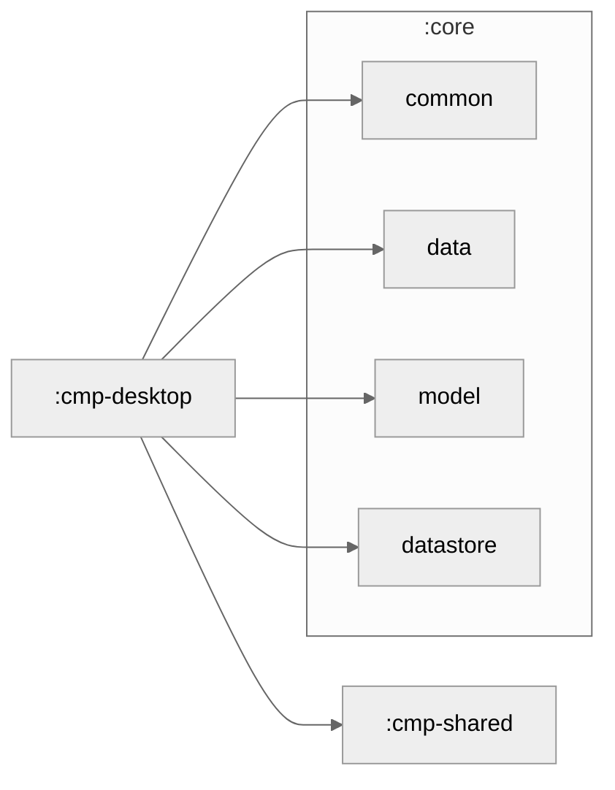

# cmp-desktop

The Desktop application for **LetaPay** - cross-platform desktop client for macOS, Windows, and Linux.

## Overview

Built with:
- **Kotlin** (JVM backend)
- **Compose Multiplatform** for UI
- **Gradle** build system with platform-specific packaging

Supports:
- **macOS** - DMG installer
- **Windows** - EXE and MSI installers
- **Linux** - DEB package

## Architecture

```
cmp-desktop/
├── src/desktopMain/kotlin/com/letapay/app/desktop/
│   ├── Main.kt              # Application entry point
│   ├── LetaPayApp.kt        # Main composable
│   └── [platform-specific code]
├── build.gradle.kts         # Desktop build configuration
└── README.md                # This file
```

## Supported Platforms

| Platform | Format | Distribution |
|----------|--------|--------------|
| **macOS** | DMG | Direct download or App Store |
| **Windows** | EXE / MSI | Microsoft Store or GitHub Releases |
| **Linux** | DEB | Package repositories or GitHub Releases |

## Build

### Prerequisites

- JDK 17+ (bundled in Gradle wrapper)
- 2GB disk space for build artifacts
- Platform-specific tools:
  - **macOS**: Xcode Command Line Tools
  - **Windows**: Visual C++ Build Tools
  - **Linux**: Build essentials (`build-essential`)

### Build Commands

```bash
# Build for current platform
./gradlew cmpDesktop:packageReleaseDistributionForCurrentOS

# Build for specific platform
./gradlew cmpDesktop:packageRelease[Windows|macOS|Linux]

# Run desktop app in development
./gradlew cmpDesktop:run
```

### Distribution Artifacts

After building, artifacts are in `cmp-desktop/build/compose/binaries/main/release/`:

- **macOS**: `LetaPay.dmg`
- **Windows**: `LetaPay.msi` (installer) + `LetaPay.exe` (portable)
- **Linux**: `letapay.deb`

## Deployment

### GitHub Releases

```bash
# Create GitHub release with binaries
./gradlew cmpDesktop:packageReleaseDistributionForCurrentOS
gh release create v1.0.0 ./cmp-desktop/build/compose/binaries/main/release/* --draft
```

### Direct Distribution

Upload binaries to:
- Own server/CDN
- Microsoft Store (Windows)
- App Store (macOS)
- Snapcraft (Linux)

## Platform-Specific Notes

### macOS

- Code signing may be required for App Store distribution
- Use `scripts/deploy_macos.sh` for App Store automation (if available)
- DMG includes automatic app installation via drag-and-drop

### Windows

- MSI includes automatic updates via Windows Update
- EXE is portable (no installation required)
- Visual C++ Runtime must be pre-installed

### Linux

- DEB package handles dependencies automatically
- Snap and AppImage formats supported with additional configuration
- Desktop entry automatically created in application menu

## Development

Desktop-specific code should:

1. Check for platform-specific APIs using `expect/actual`
2. Use Compose Multiplatform APIs only
3. Handle window resizing and high-DPI displays
4. Test on all three platforms

```kotlin
// Example: Platform-specific code
expect fun getPlatformName(): String

actual fun getPlatformName(): String = "macOS/Windows/Linux"
```

## Feature Parity

Desktop maintains feature parity with mobile platforms:
- ✅ Wallet connect
- ✅ Chat with AI agents
- ✅ Send payments
- ✅ View transaction history
- ✅ Swaps
- ✅ Staking

## Performance

Desktop builds are optimized for:
- Fast startup (< 2 seconds)
- Low memory footprint
- Efficient battery usage (if applicable)
- Quick interaction response time

Use Compose Profiler to monitor performance:

```bash
./gradlew cmpDesktop:run --profiler
```

## Troubleshooting

### Build Fails

Check:
- JDK version: `java -version`
- Gradle version: `./gradlew --version`
- Platform tools installed

### App Crashes on Startup

- Check logs in `~/.letapay/logs/`
- Run with debug mode: `java -Ddebug=true -jar letapay.jar`
- Report issue with crash dump

### Packaging Issues

- Ensure `packagingOptions` are configured in `build.gradle.kts`
- Check native library dependencies
- Run `./gradlew clean` before rebuilding

## Module Graph



## Resources

- [Compose Multiplatform Documentation](https://www.jetbrains.com/help/compose-multiplatform/)
- [Gradle Build Documentation](https://gradle.org)
- [Desktop App Best Practices](https://www.jetbrains.com/help/compose-multiplatform/desktop-get-started.html)
