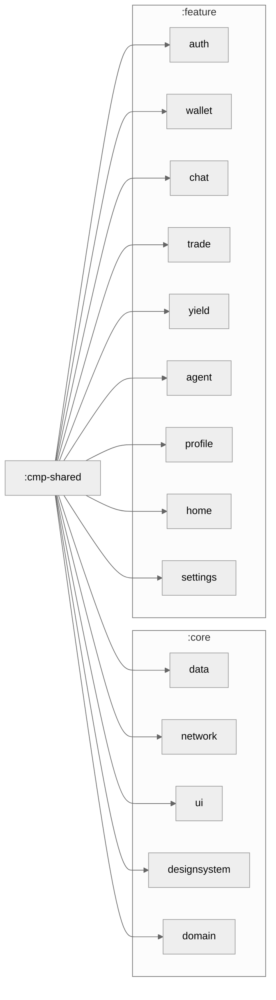

# cmp-shared

Shared multiplatform UI components and screens for LetaPay built with **Compose Multiplatform**.

This module contains:
- Shared Composable functions used across all platforms (Android, iOS, Desktop, Web)
- Custom components specific to LetaPay (LetaButton, ShimmerBox, etc.)
- Shared UI theme and animations
- Common screens and navigation logic

## Architecture

```
cmp-shared/
├── src/commonMain/kotlin/cmp/shared/
│   ├── ui/
│   │   ├── components/     # LetaButton, BackendErrorBanner, TypingIndicator
│   │   ├── screens/        # Common screens
│   │   └── theme/          # LetaTheme, LetaColors, LetaShapes, LetaSpacing
│   └── AppState.kt         # Global app state
├── composeResources/       # Images, strings, fonts
└── build.gradle.kts
```

## Module Graph



## Key Components

### UI Components

- **LetaButton** - Primary button with Loading state
- **BackendErrorBanner** - Error display with retry logic
- **TypingIndicator** - Animated indicator for AI responses
- **ShimmerBox** - Skeleton loading animation

### Theme

- **LetaTheme** - Custom Material 3 theme for LetaPay
- **LetaColors** - Color palette (Primary: #6B5FFF, Secondary: #FF6B6B)
- **LetaShapes** - Rounded corner specifications
- **LetaSpacing** - Spacing scale
- **LetaAnimations** - Shared animation specs

## Dependencies

- `androidx.compose.ui:ui`
- `androidx.compose.foundation:foundation`
- `androidx.compose.material3:material3`
- `org.jetbrains.compose.components:components-resources`

## Usage

```kotlin
import cmp.shared.ui.theme.LetaTheme
import cmp.shared.ui.components.LetaButton

@Composable
fun MyScreen() {
    LetaTheme {
        LetaButton(
            text = "Send Payment",
            onClick = { /* handle click */ },
            modifier = Modifier.fillMaxWidth()
        )
    }
}
```

## Development

To add new shared components:

1. Create component in `src/commonMain/kotlin/cmp/shared/ui/components/`
2. Ensure it uses only Compose Multiplatform APIs
3. Add unit tests
4. Document in this README
5. Update theme if needed in `LetaTheme.kt`
