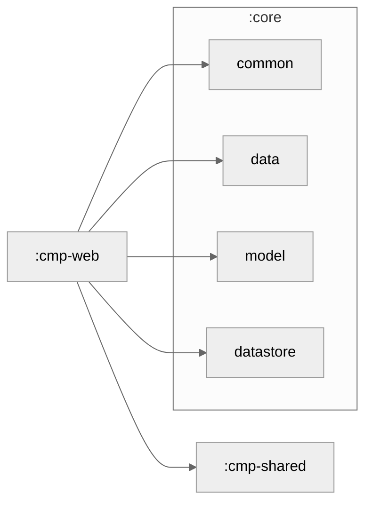

# cmp-web

The Web application for **LetaPay** - browser-based client built with Kotlin/JS and Compose Multiplatform.

## Overview

Built with:
- **Kotlin/JS** - Kotlin compiled to JavaScript
- **Compose Multiplatform for Web** - Declarative UI framework
- **Webpack** - Module bundler (via Gradle)
- **HTML5 & CSS3** - Web standards support

Deployment:
- **GitHub Pages** - Continuous deployment on `gh-pages` branch
- **Custom servers** - Deploy compiled JS/HTML anywhere

## Architecture

```
cmp-web/
├── src/jsMain/kotlin/com/letapay/app/web/
│   ├── Main.kt              # Application entry point
│   ├── LetaPayApp.kt        # Main composable
│   └── [web-specific code]
├── build.gradle.kts         # Web build configuration
└── README.md                # This file
```

## Build

### Prerequisites

- Node.js 18+ (for dev server and build tools)
- JDK 17+ (for Gradle)

### Build Commands

```bash
# Development server (hot reload)
./gradlew wasmJsBrowserDevelopmentRun

# Production build
./gradlew wasmJsBrowserDistribution

# Optimization (tree-shaking, minification)
./gradlew wasmJsBrowserProductionWebpack
```

### Build Output

After building, distribution files are in `cmp-web/build/dist/wasmJs/`:

- `index.html` - Entry point
- `letapay.js` - Compiled JavaScript
- `letapay.wasm` - WebAssembly module (optional)
- `letapay.css` - Styles

## Development

### Hot Module Replacement

During development, the web app automatically reloads when code changes:

```bash
./gradlew wasmJsBrowserDevelopmentRun
```

Open browser to `http://localhost:8080/` and start editing!

### Browser DevTools

Kotlin/JS integrates with:
- Chrome DevTools - Set breakpoints in Kotlin code (with source maps)
- Firefox Developer Tools - Full debugging support
- VS Code Debugger - Integrated debugging

## Deployment

### GitHub Pages

GitHub Actions automatically deploys to `gh-pages` branch on push to `main`:

```bash
# Manual deployment
./gradlew wasmJsBrowserDistribution
git checkout gh-pages
cp -r cmp-web/build/dist/wasmJs/* .
git add .
git commit -m "Deploy web app"
git push origin gh-pages
```

Visit: `https://Wolfof420Street.github.io/Leta-Pay-KMP/`

### Custom Server

1. Build the app: `./gradlew wasmJsBrowserDistribution`
2. Upload contents of `cmp-web/build/dist/wasmJs/` to your server
3. Serve via HTTP/HTTPS with proper CORS headers

### Docker

```dockerfile
FROM nginx:alpine
COPY cmp-web/build/dist/wasmJs/ /usr/share/nginx/html/
```

## Platform-Specific Notes

### Browser Support

- ✅ Chrome 90+
- ✅ Firefox 88+
- ✅ Safari 14+
- ✅ Edge 90+

### HTTPS Required

WalletConnect and some crypto APIs require HTTPS in production.

### Web3 Integration

Web app supports:
- **WalletConnect** - Connect via QR code
- **Ledger** - Hardware wallet support
- **MetaMask** - Browser extension
- **Trezor** - Hardware wallet support

### Security Considerations

- ✅ Session tokens stored in memory only
- ✅ No persistent refresh tokens on web
- ✅ HTTPS enforced
- ✅ Content Security Policy (CSP) headers configured
- ✅ Same-origin policy enforced

### Storage

Uses browser APIs:
- `localStorage` - Persistent user preferences
- `sessionStorage` - Temporary session data
- `IndexedDB` - Large-scale client-side storage

**Note**: Web version does NOT store refresh tokens to prevent XSS attacks.

## Performance

### Optimizations

- Code splitting via Webpack
- Lazy loading of features
- Tree-shaking unused code
- Minification and compression
- WebAssembly for performance-critical paths

### Metrics

Typical page load:
- Initial load: ~2-3 seconds
- Time to interactive: ~1-2 seconds
- Bundle size: ~300-400 KB (gzipped)

Monitor with:

```bash
# Build and analyze bundle size
./gradlew wasmJsBrowserDistribution --scan
```

## Troubleshooting

### Build Fails

Check:
- Node.js version: `node --version`
- npm cache: `npm cache clean --force`
- Clear Gradle cache: `./gradlew clean`

### App Blank/White Screen

- Check browser console for JS errors
- Verify network requests in DevTools
- Check `index.html` is being served
- Ensure CORS headers are correct (if backend on different origin)

### WalletConnect Issues

- Verify WalletConnect project ID is set
- Check user is on HTTPS (required for Web3)
- Ensure popup blocker is disabled
- Try different wallet (MetaMask, Ledger, etc.)

### Performance Issues

- Reduce bundle size by removing unused dependencies
- Enable code splitting for large features
- Use Firefox DevTools for profiling
- Check network waterfall for slow API calls

## Feature Parity

Web maintains feature parity with mobile/desktop:
- ✅ Wallet connect (via QR)
- ✅ Chat with AI agents
- ✅ Send payments
- ✅ View transaction history
- ✅ Swaps
- ✅ Staking
- ⚠️ Biometric auth (not available on web)

## Module Graph



## Resources

- [Kotlin/JS Documentation](https://kotlinlang.org/docs/js-overview.html)
- [Compose for Web](https://www.jetbrains.com/help/compose-multiplatform/web-getting-started.html)
- [Web3.js Documentation](https://web3js.readthedocs.io/)
- [WalletConnect Documentation](https://docs.walletconnect.com/)