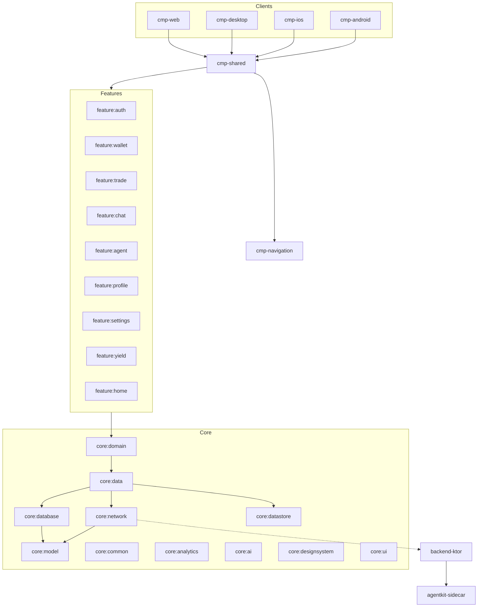

# Architecture Overview

This document describes the high-level architecture of the Leta Pay project, including data flow, dependency injection, and state management.

## Module Graph

The project follows a modular structure to separate concerns and enable multiplatform support.

## Data Flow

The project adheres to **Unidirectional Data Flow (UDF)** principles.

1.  **UI**: Compose Multiplatform components observe state from ViewModels.
2.  **ViewModel**: Manages UI state and handles user actions by calling UseCases or Repositories.
3.  **Domain**: Contains business logic and UseCases.
4.  **Data**: Repositories manage data from local (Room/SQLDelight) and remote (Ktor) sources.
5.  **Network**: Ktor client handles communication with the backend.

## Dependency Injection

**Koin** is used as the DI framework across all platforms, including the backend.

-   **Client**: Initialized in `cmp-shared/src/commonMain/kotlin/cmp/shared/utils/KoinExt.kt`.
-   **Backend**: Configured in `backend-ktor/src/main/kotlin/com/letapay/backend/plugins/DependencyInjection.kt`.

### Key Modules
-   `DataModule`: Repositories and local data sources.
-   `NetworkModule`: Ktor client and API services.
-   `DatabaseModule`: SQLDelight database instance.
-   `FeatureModule`: Feature-specific ViewModels and logic.
-   `PlatformModule`: Platform-specific implementations (e.g., File system, Bluetooth).

## State Management

-   **ViewModels**: Utilize `StateFlow` to expose immutable state to the UI.
-   **Actions**: User interactions are passed to ViewModels via functions or sealed classes.
-   **Side Effects**: Managed using `LaunchedEffect` or custom effect flows in ViewModels.

## Networking

-   **Framework**: Ktor Client.
-   **Serialization**: Kotlinx Serialization.
-   **Error Handling**: Custom `AppError` and `Resource` wrappers for handling network results.

## Backend Architecture

The backend is built with **Ktor Server** and follows a Service-Repository pattern.

-   **Routing**: Defined in `com.letapay.backend.routes`.
-   **Services**: Encapsulate business logic (e.g., `SwapService`, `AuthService`).
-   **Security**: JWT-based authentication with SIWE (Sign-In with Ethereum) support.
-   **Database**: JetBrains Exposed ORM with PostgreSQL.
-   **AI Integration**: Interacts with the `agentkit-sidecar` for CDP AgentKit operations.
