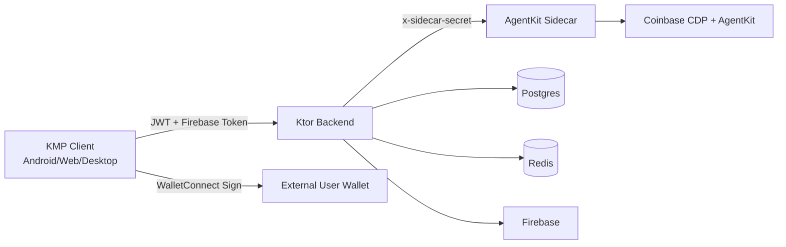

# Architecture

## 1. System Topology

LetaPay is a layered, policy-driven system:

1. KMP Frontend (Android/Web/Desktop): intent capture, chat UX, preview UX, and WalletConnect signing.
2. Ktor Backend: authentication, validation, idempotency, rate-limit enforcement, kill switch enforcement, and transaction lifecycle recording.
3. AgentKit Sidecar (Node.js): internal action provider layer that builds unsigned calldata only.

## 2. Non-Custodial Security Model

### Why Ktor owns kill switch + idempotency

Ktor is the policy boundary exposed to clients. It must be the only place where value-moving requests are accepted and governed.

- Kill switch (`KILL_SWITCH_VALUE_MOVES`) is checked before executing value-moving routes (`/transactions/build`, `/transactions/send`, `/swap/*`, `/yield/*`).
- Idempotency keys are enforced and replayed at the backend boundary to prevent duplicate value movement and to preserve deterministic API responses on retry.
- Request validation and machine-readable error envelopes are normalized in one place (`ErrorResponse`).

### Why Sidecar only builds unsigned calldata

The sidecar is intentionally internal and stateless relative to custody.

- It receives internal requests with `x-sidecar-secret` and should never be internet-exposed.
- It translates high-level action parameters into unsigned calldata payloads.
- It does not hold user private keys and does not broadcast signed transactions.
- This keeps signing authority with the wallet owner and keeps transaction policy enforcement in Ktor.

## 3. Request Governance Boundaries

### Client boundary

- User inputs intent and confirms preview.
- WalletConnect performs signature operation externally.

### Backend boundary

- Authenticates session principal.
- Validates chain/asset/opportunity parameters.
- Applies global + wallet-scoped rate limits.
- Applies kill switch and idempotency checks.
- Persists transaction/yield state.

### Sidecar boundary

- Consumes internal-only traffic.
- Calls AgentKit/CDP providers.
- Returns unsigned calldata or sidecar error payload.

## 4. Data Flow: AI Intent -> Build -> Sign -> Broadcast

### End-to-end path

1. User submits command in chat UI (`send`, `swap`, `stake`).
2. Client parser/orchestrator derives structured intent and preview plan.
3. Client requests backend build route (`/transactions/build`, `/swap/execute`, or `/yield/stake`) with idempotency metadata where required.
4. Ktor validates request, checks kill switch/rate limit/idempotency, and calls sidecar.
5. Sidecar uses AgentKit/CDP to construct unsigned calldata (`to`, `data`, `value`, gas fields, `chainId`, optional `nonce`).
6. Ktor returns unsigned payload in normalized backend response.
7. Client passes unsigned payload to WalletConnect signing flow.
8. Client submits signed tx to `/transactions/send` with `Idempotency-Key` and context headers.
9. Ktor records submission, registers pending notification watcher, and responds with `txHash` + status.
10. Client fetches/streams lifecycle updates and renders summary.

## 5. Error & Resilience Strategy

- Backend always returns machine code + message envelope.
- Sidecar/provider failures are absorbed into controlled backend error states.
- `AGENTKIT_UNAVAILABLE` is reserved for sidecar/capability outage handling and should disable AI action controls in client UX.
- Gateway timeout, conflict, validation, and kill-switch states are explicit and parseable by clients.

## 6. Deployment Shape

Typical local/prod decomposition:

- `ktor-backend`: public API ingress
- `agentkit-sidecar`: private network only
- `postgres`: system-of-record state
- `redis`: ephemeral coordination/cache support
- Frontend targets consume backend over HTTP(S), never sidecar directly
